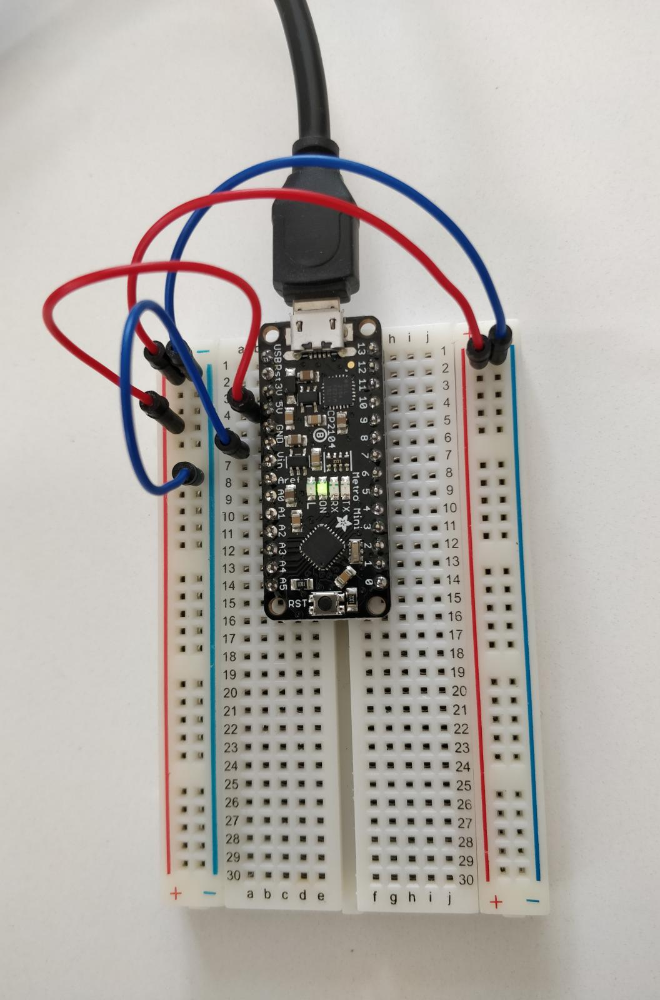
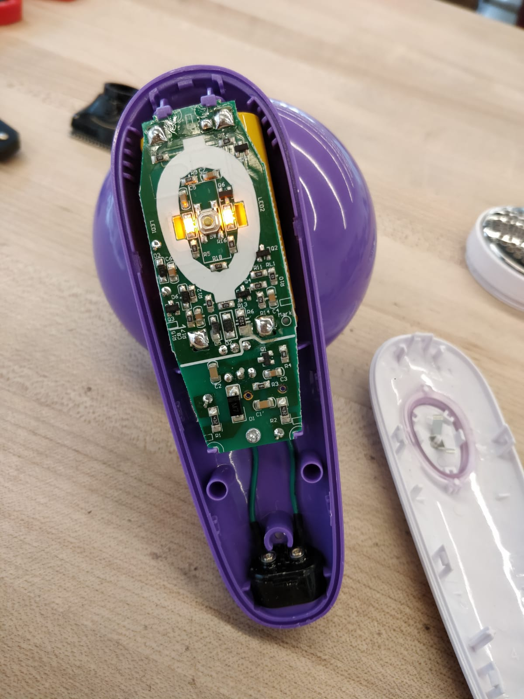
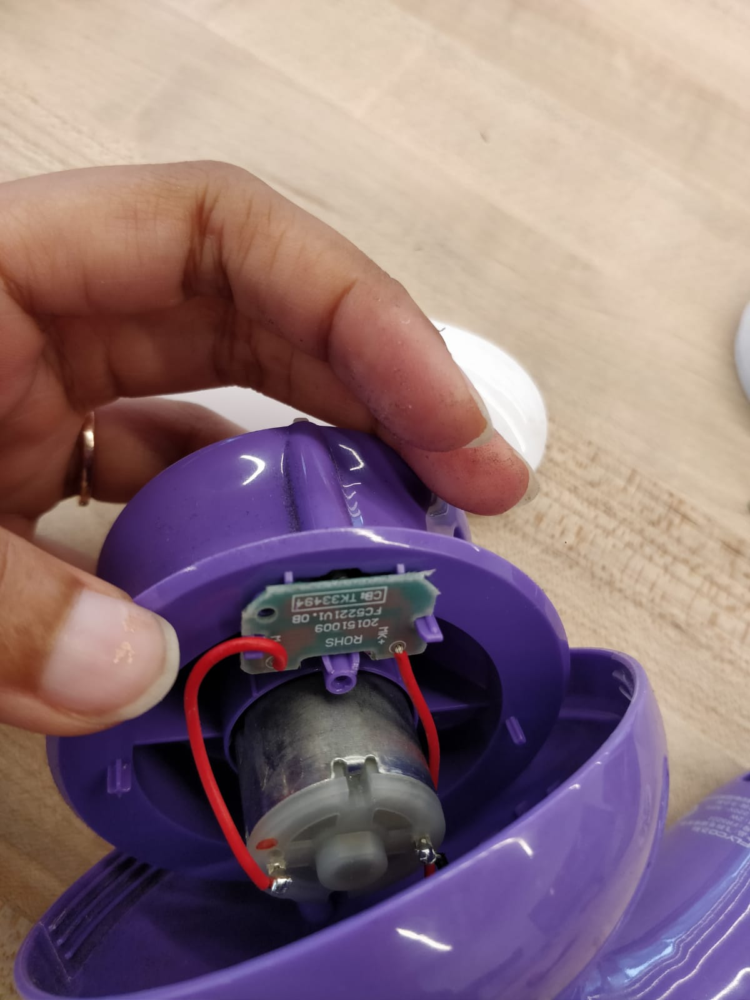
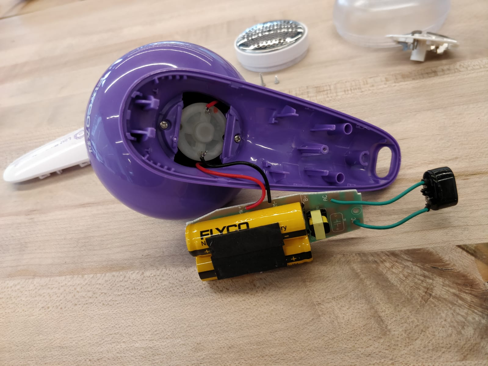
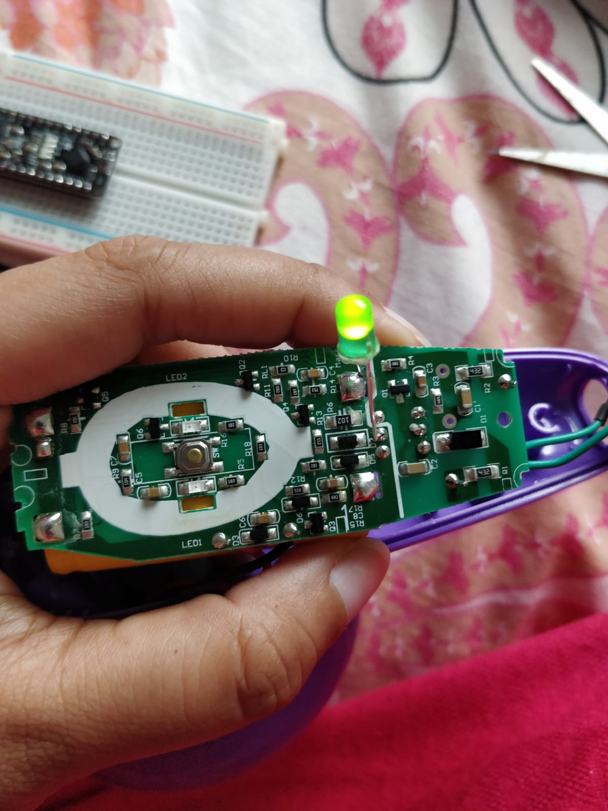

# IDD-Fa18-Lab1: Blink!

**A lab report by Ananya Paul. Student**

**Fork** this repository to get a template for Lab 1 for *Developing and Designing Interactive Devices* at Cornell Tech, Fall 2019. You should modify this `README.md` file to delete this paragraph and update below. As the lab asks:

> Include your responses to the bold questions on your own fork of the lab activities. Include snippets of code that explain what you did. Deliverables are due next Tuesday. Post your lab reports as `README.md` pages on your GitHub, and post a link to that on your main class hub page.

We've copied the questions from the lab here. Answer them below!

## Part A. Set Up a Breadboard

## Part B. Manually Blink a LED

**a. What color stripes are on a 100 Ohm resistor?**
The colours on a 100 Ohm resistor are Brown, Black, Brown, Gold.

 
**b. What do you have to do to light your LED?**
To light the LED, press down the button and hold it, when the putton is not pressed, LED turns off. 

## Part C. Blink a LED using Arduino

### 1. Blink the on-board LED

**a. What line(s) of code do you need to change to make the LED blink (like, at all)?**
The line with pinMode and digitalWrite. Replaced all occurences of LED_BUILTIN with the pin number for LED which is 9 in my case.

**b. What line(s) of code do you need to change to change the rate of blinking?**
The delay function controls the rate of the blinking. I changed the value of delay to higher like 1500  for slower blinking and lower like 50 for faster blinking to change the rate of the blinking.

**c. What circuit element would you want to add to protect the board and external LED?**
I would like to add a resistor in the circuit to protect the board and external LED from a short circuit.
 
**d. At what delay can you no longer *perceive* the LED blinking? How can you prove to yourself that it is, in fact, still blinking?**
At delay 11, it can no longer be percieved that the LED is blinking. 
To prove, the LED is on and there is a slight vibration. 
When seen from the corner of an eye, the blinking can be seen when it is blinking. But not when it is just on without any delay.

**e. Modify the code to make your LED blink your way. Save your new blink code to your lab 1 repository, with a link on the README.md.**

[My Blink](./my_blink.ino)

### 2. Blink your LED

**Make a video of your LED blinking, and add it to your lab submission.**

[LED Blinking](https://youtu.be/JS9MkcEiPCo)

## Part D. Manually fade an LED

**a. Are you able to get the LED to glow the whole turning range of the potentiometer? Why or why not?**
Yes. The Potentiometer controls the flow of the voltage and hence the current that lights up the LED. Depending on the current, the LED glows or dims to the fullest range.

## Part E. Fade an LED using Arduino

**a. What do you have to modify to make the code control the circuit you've built on your breadboard?**
The value of the integer variable led. For this part, I set it to 11.

**b. What is analogWrite()? How is that different than digitalWrite()?**
The analogWrite() method sets the value of a PWM output pin. The analogWrite() is on a scale of 0 - 255, such that analogWrite(255) requests a 100% duty cycle (always on), and analogWrite(127) is a 50% duty cycle (on half the time).
The digitalWrite() will set the specified pin to one of two states - HIGH/LOW, which equate to 5v (3.3v on some boards) and ground respectively.
[Reference](https://arduino.stackexchange.com/questions/35873/whats-the-difference-between-analogwrite-and-digitalwrite)

## Part F. FRANKENLIGHT!!!

### 1. Take apart your electronic device, and draw a schematic of what is inside. 
The device that I chose is a Lint Remover. I took apart the pieces and attached images of what's inside. 

**a. Is there computation in your device? Where is it? What do you think is happening inside the "computer?"**
The computation is a switch that lights LEDs on the chip which is essentially a toggle function since the board is powered by batteries. The PCB(printed circuit board) has resistors and capacitors in it to control the flow of the current.

**b. Are there sensors on your device? How do they work? How is the sensed information conveyed to other portions of the device?**
No, There are no sensors in the device. 

**c. How is the device powered? Is there any transformation or regulation of the power? How is that done? What voltages are used throughout the system?**
The device is powered through 2 rechargable batteries that are connected to an AC current by a ROHS transformer. The device supports 220V - 50Hz, and power of 2 Watts. 

**d. Is information stored in your device? Where? How?**
No

### 2. Using your schematic, figure out where a good point would be to hijack your device and implant an LED.

**Describe what you did here.**
I connected my LED to the power source itself, to the point where the batteries are soldered into the chip. I experimented with the longer arm of the LED connected to the positive end of the battery and connecting the other side to differnt other points on the board to see the intensity of light controlled by the resistance distributed in the circuit.

### 3. Build your light!

**Make a video showing off your Frankenlight.**

[Frankenlight video](https://youtu.be/8q87IhuOJeY)

**Include any schematics or photos in your lab write-up.**
